# Bangladesh Digital Land Platform — Visual Feature Guide
## ভূমি সেবা — Features, Problems, Improvements & Where to Find Them (Bangladesh only)

| | |
|---|---|
| **Document type** | Feature guide & improvement blueprint (Bangladesh only) |
| **Date** | 17 August 2026 |
| **Version** | 3.1 — visual edition (diagrams · charts · comparison tables) |
| **Scope** | Every current Bangladesh land feature — what it does, **which app/website it lives on**, the problem citizens face, and how to improve it. All foreign/international benchmarking removed. |
| **Diagrams** | Rendered with **Mermaid** — view on GitHub, VS Code (Markdown Preview Mermaid), Obsidian, GitLab, or any Mermaid-enabled Markdown viewer. |

> **Note on figures:** all coverage/progress numbers are government-programme statistics as of the date cited. They change often — re-check them at the source link before using them for any decision.

---

## How to read this document

For **each Bangladesh land feature** you get the same four things, in the same order, now with a **structure diagram**:

1. **What it is** — the current government capability.
2. **Where to find it** — the exact app or website (with the link).
3. **Problem** — what makes it hard to use today.
4. **Improvement** — how to make it better, drawn as a flow diagram.

### Quick glossary — Bangla land terms

| Bangla | Transliteration | Meaning |
|---|---|---|
| নামজারি | Namjari | Mutation — updating the ownership record |
| ভূমি উন্নয়ন কর | Bhumi Unnayan Kar | Land Development Tax |
| খতিয়ান | Khatian | Record-of-rights / ownership register entry |
| দাগ | Dag | Plot number on a mouza map |
| মৌজা | Mouza | Lowest cadastral/revenue map unit |
| দাখিলা | Dakhila | Land-tax payment receipt |
| খারিজ | Kharij | Separation/mutation of a share |
| দলিল | Dolil | Registered deed |
| ইউনিয়ন · উপজেলা · জেলা | Union · Upazila · Zila | Administrative tiers |
| ভূমি সেবা হটলাইন | Bhumi Sheba Hotline | Land service hotline (16122) |

---

## Table of Contents

1. Executive Summary — the shift
2. Where to Find Everything
3. e-Mutation / নামজারি
4. Land Development Tax / ভূমি উন্নয়ন কর
5. Online Land Payment
6. Digital Land Maps & the Bangladesh Digital Survey (BDS)
7. Land History
8. Acquisition & Compensation
9. Lease & Settlement
10. Revenue Cases
11. Complaint & 16122 Support
12. Main Bangladesh Gaps
13. Proposed "My Land Bangladesh" Product
14. Technical Architecture, Database, PostGIS, Mapping, APIs
15. Security & Trust
16. Implementation Roadmap
17. Priority Feature Matrix
18. What NOT to Do
19. Core Product Concept
20. Conclusion
21. Appendix — Verified Figures & Sources

---

## 1. Executive Summary — the shift

Bangladesh has already built a substantial digital land-service ecosystem: **নামজারি (mutation), ভূমি উন্নয়ন কর (land tax), land records and maps, acquisition, lease/settlement, revenue cases, land-information services, and complaint/technical support**.

So the main problem is **not the absence of digital services**. The bigger problem is that the citizen experience is still **service-centric and identifier-centric**.

### The mental model today vs. the target model

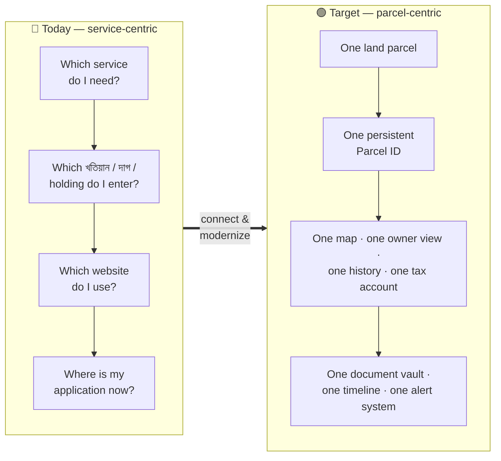

### The parcel-centric idea, in one picture

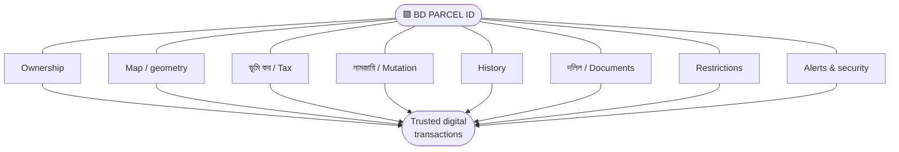

### Old model vs. target model — side by side

| Dimension | 🔴 Old model (today) | 🟢 Target model |
|---|---|---|
| **Centre of gravity** | The service/form | The land parcel |
| **How you start** | Pick a service, then enter IDs | Tap your parcel on a map |
| **Identifier** | Many (খতিয়ান, দাগ, holding, case no.) | One stable **Parcel ID** (IDs kept internally) |
| **Where data lives** | Several separate portals | One property profile, many sources |
| **History** | A list of documents | A verifiable timeline |
| **Payment** | "Did it go through?" | Transaction ID + reconciliation + receipt |
| **Awareness** | You check manually | Proactive activity alerts |
| **Government benefit** | Duplication, hard to audit | Cleaner data, auditable, fraud-detection support |

> **The opportunity:** connect and modernize what already exists, rather than build yet another isolated land portal.

---

## 2. Where to Find Everything

The single most-asked question — *"where do I actually find this?"*

| Feature | Where to find it (app / website) | Link |
|---|---|---|
| Main entry point (all services) | Ministry of Land website | https://www.land.gov.bd/ |
| Citizen services (Bangla) — নাগরিক সুবিধা | Ministry of Land | https://land.gov.bd/nagorik-subidha?lang=bn |
| e-Mutation / নামজারি | **Web:** mutation portal · **App:** "নামজারি" (Android, Google Play) | https://mutation.land.gov.bd/ |
| Land Development Tax / ভূমি উন্নয়ন কর | LDTax portal | https://ldtax.gov.bd/ |
| LDTax — how-to manual | LDTax citizen user manual | https://traininglims.land.gov.bd/limslrb/ldtax/citizen/user_manual |
| Online land-tax payment | LDTax portal + bKash | https://www.bkash.com/en/products-services/land-tax |
| Digital land map | Smart Bhumi Naksha (map portal) | https://map.land.gov.bd/ |
| Complaint / technical support | ভূমি সেবা হটলাইন — **call 16122** or web | https://hotline.land.gov.bd/ |
| Service manuals / guides | Ministry of Land manual | https://www.land.gov.bd/manual |

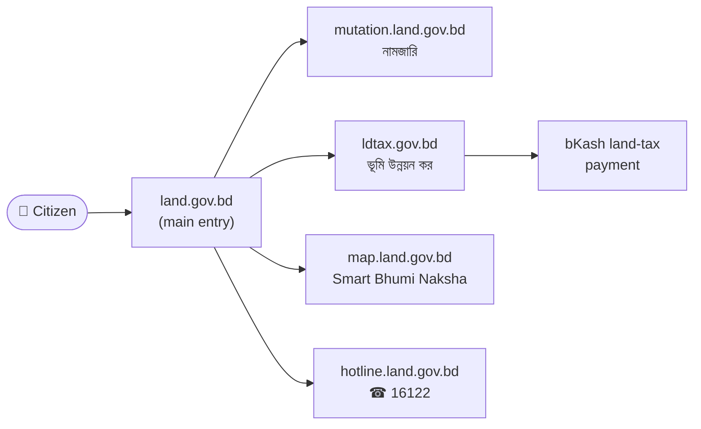

---

## 3. e-Mutation / নামজারি

### What it is
An official e-Mutation (নামজারি) workflow with online application and supporting-document handling: online application, document upload, fee payment, application tracking, online hearing/processing components, and digital/QR-verifiable mutation documents.

**Verified scale and performance**

| Metric | Value | Note |
|---|---|---|
| Applications filed nationally | **~22 lakh (≈2.2 million)/yr** | Ministry of Land e-Namjari app listing |
| Statutory processing window | **45 working days** | 2025 Ministry circular prioritising online applications |
| Governing law | Land Reforms Ordinance 1984 | Sets the 60-bigha agricultural ownership ceiling |
| Channel | mutation.land.gov.bd + "নামজারি" Android app | In-person hearing & DCR collection often still required |

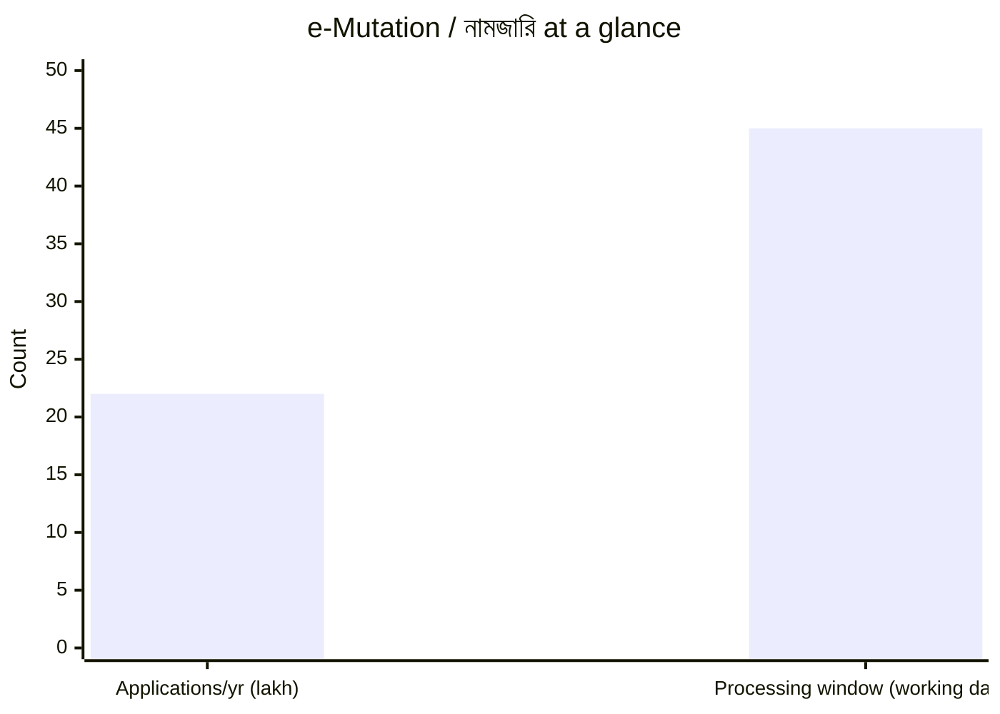

### Where to find it
- **Website:** https://mutation.land.gov.bd/
- **Mobile app:** "নামজারি" (e-Namjari) on Google Play
- **Guidance:** https://www.land.gov.bd/manual

### Problem
The workflow makes citizens think in government data structures — **খতিয়ান, দাগ, মৌজা, land amount, mutation type, documents**. The citizen's real mental model is simpler:

> "I bought / inherited / got this property. I want the government record updated."

### Improvement — a **Mutation Wizard** that starts from the property, not the paperwork

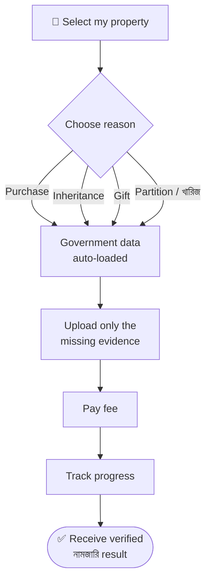

---

## 4. Land Development Tax / ভূমি উন্নয়ন কর

### What it is
A dedicated online Land Development Tax platform. Registration uses mobile number, NID number, NID date of birth, and দাখিলা / খারিজ-খতিয়ান information. It supports online tax assessment/payment, with assisted service through Union Digital Centres.

### Where to find it
- **Website:** https://ldtax.gov.bd/
- **User manual:** https://traininglims.land.gov.bd/limslrb/ldtax/citizen/user_manual

### Problem
The portal's own dashboard exposes the relationship between খতিয়ান entries and holding entries, and reconciliation rates are **not yet 100% across divisions**.

> **A digital UI is not the same as clean digital data.**

### Improvement — a **Land Data Reconciliation Engine** that continuously cross-checks the chain

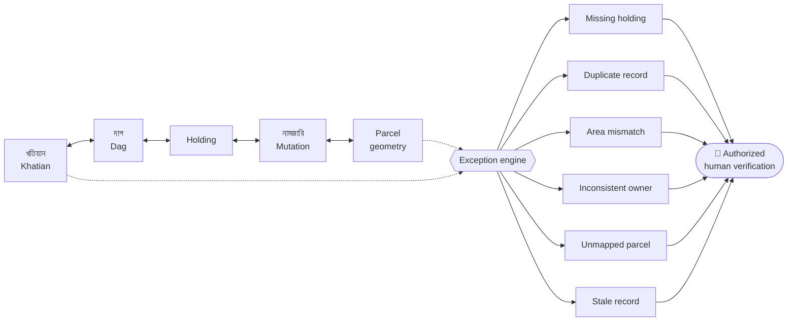

Automatically flag anomalies, then **route exceptions to authorized human verification**.

---

## 5. Online Land Payment

### What it is
Online land-tax payment through multiple digital channels, with digital confirmation/receipt (দাখিলা) workflows.

### Where to find it
- **LDTax portal:** https://ldtax.gov.bd/
- **bKash land-tax service:** https://www.bkash.com/en/products-services/land-tax

### Problem
The hardest problem is not a lack of channels — it is **payment certainty**:

> "Money was deducted. Did the government actually receive it?"

### Improvement — a permanent transaction reference + a clear state machine

Give every transaction a permanent reference (e.g. `BD-LAND-TX-2026-0001938`) and a defined state machine:

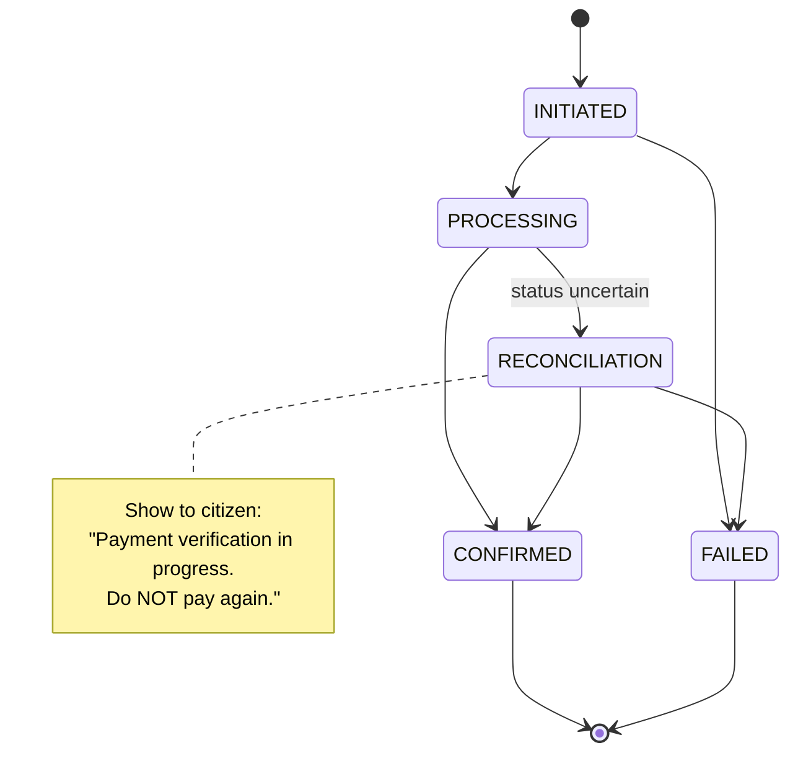

**Then show a completion timeline the citizen can trust:**


| Step | Meaning | State when done |
|---|---|---|
| Tax calculated | Assessment ready | ✅ |
| Payment initiated | Citizen paid | ✅ |
| Gateway confirmed | Payment provider acknowledged | ✅ |
| Treasury confirmed | Government received funds | ✅ |
| Tax account updated | Ledger reflects payment | ✅ |
| দাখিলা generated | Receipt issued | ✅ |

---

## 6. Digital Land Maps & the Bangladesh Digital Survey (BDS)

### What it is
Bangladesh has meaningful digital mapping work **and** a live national cadastral re-survey — the most important real infrastructure for a parcel-centric platform.

**Mouza & Plot Based National Digital Land Zoning Project**

| Metric | Figure |
|---|---|
| মৌজা covered | 56,348 |
| ইউনিয়ন covered | 4,562 |
| উপজেলা covered | 493 (all 64 জেলা) |
| Map sheets scanned / geo-referenced / field-checked | 1,38,412 |
| Purpose | Classify land use (agricultural, residential, forest, waterway, industrial, tea garden, coastal, grazing…) to protect arable land & support planning |

The **Smart Bhumi Naksha** citizen map already supports plot viewing, land-use info, location-based মৌজা/plot lookup, plot search and area information.

**Bangladesh Digital Survey (BDS)** — a full re-survey of the national cadastre using satellites, drones/UAVs, GNSS and Ground Control Stations, run under the EDLMS project by DLRS (with South Korean technology partners). It:
- Replaces the old paper-based survey with a geo-referenced one
- Implements a **"1 person, 1 খতিয়ান, 1 দাগ"** consolidation policy
- Produces geo-referenced মৌজা maps that update as নামজারি records change
- Is designed as a module of the National Land Service Automation System

**Verified rollout status**

| Metric | Figure |
|---|---|
| First-phase pilot area | Chattogram, Narayanganj & Rajshahi City Corporations; Dhamrai & Kushtia Sadar উপজেলা; Manikganj municipality |
| Pilot coverage | 634 মৌজা across 933 sq km |
| Geo-referencing points nationally | 2,60,310 across 470 উপজেলা (excl. 3 Chattogram Hill Tract জেলা) |
| মৌজা-map database | 1,33,188 মৌজা maps |
| Reported progress (EDLMS/BDS) | **~37%** (Ministry briefing, pre-2026) |
| Target completion | **2026** |

**BDS progress — reported ~37%**

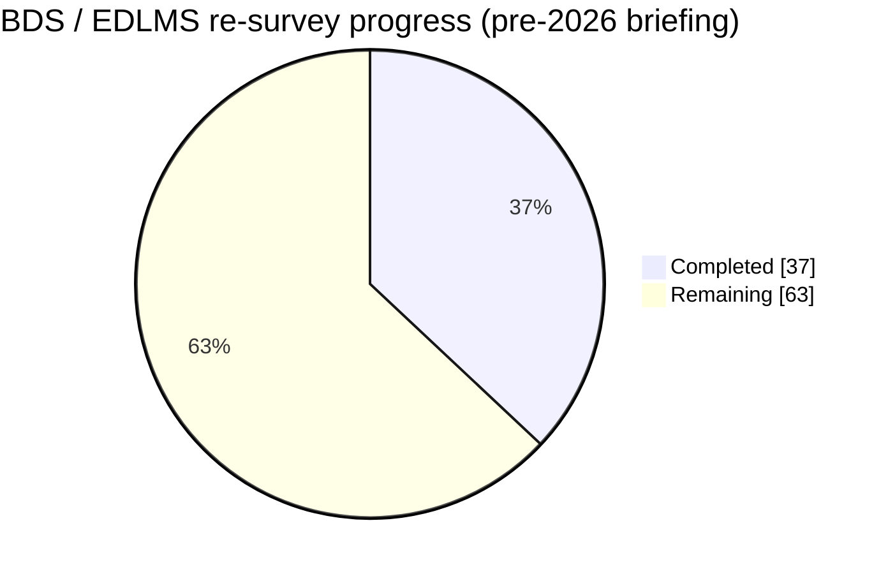

> BDS is the mechanism that makes a stable, geo-referenced **Parcel ID** possible at national scale — the real-world prerequisite for the "BD Parcel ID" idea, not a hypothetical.

### Where to find it
- **Smart Bhumi Naksha map:** https://map.land.gov.bd/

### Problem
The map is valuable, but today it works like a **separate lookup tool**. It should be the **entry point to the whole property record**.

### Improvement — make the map the front door to the land record

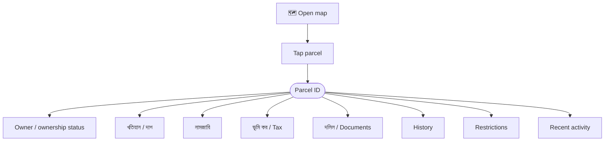

> **Architecture rule:** never treat Google Maps or another commercial basemap as the authoritative cadastral source. Use official cadastral/survey data as the authoritative parcel geometry; use Google Maps / Mapbox / MapLibre / OSM only as a visualization/context layer. Also provide controlled APIs so authorized third parties can query a parcel.

---

## 7. Land History

### What it is
Online access to land / ownership / দাগ history.

### Where to find it
- Via the Ministry of Land service ecosystem — https://www.land.gov.bd/ · https://land.gov.bd/nagorik-subidha?lang=bn

### Problem
A **list of documents is not the same as an understandable history**.

### Improvement — a **Land Timeline** where every event carries date, authority, Parcel ID, what changed, supporting দলিল and verification status

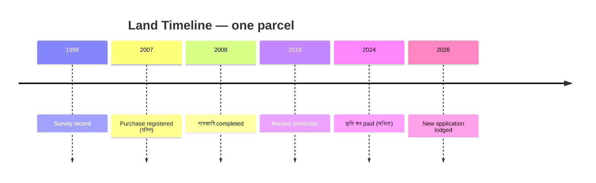

Also expose **three clear states** so a buyer or owner always knows the real position:

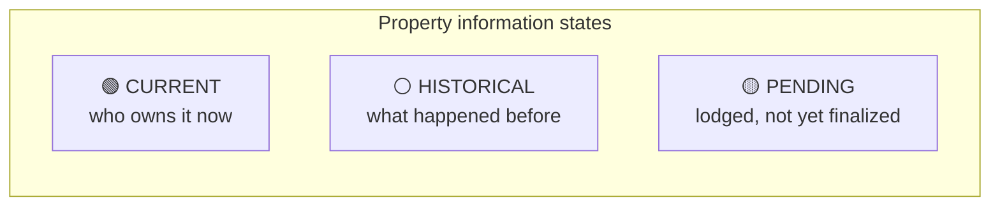

This makes suspicious or inconsistent events much easier to spot.

---

## 8. Acquisition & Compensation

### What it is
A dedicated acquisition/requisition service area, including digitization of acquisition information and compensation-related services. Some parts are described as under construction/development.

### Where to find it
- Under the Ministry of Land service areas — https://www.land.gov.bd/

### Problem
Citizens often can't see where their acquisition case stands or who is handling it.

### Improvement — a citizen-facing **Acquisition Case Timeline**

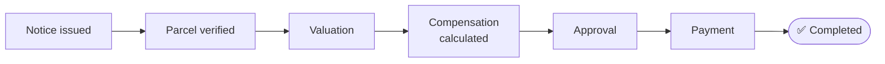

The citizen should always know: **What happened? What happens next? Who is handling the case?**

---

## 9. Lease & Settlement

### What it is
Lease/settlement is among the Ministry's land-service areas, with ongoing digitalization.

### Where to find it
- Under the Ministry of Land service areas — https://www.land.gov.bd/

### Problem
The lease/settlement journey is not transparent end-to-end.

### Improvement — a clear, trackable flow (transparent status where legally appropriate)


---

## 10. Revenue Cases

### What it is
Land revenue cases are an official service area.

### Where to find it
- Under the Ministry of Land service areas — https://www.land.gov.bd/

### Problem
A case is shown mostly as an abstract case number (e.g. `Case ID: 2026-XXXXX`) instead of being tied to the actual property.

### Improvement — link every case directly to the parcel

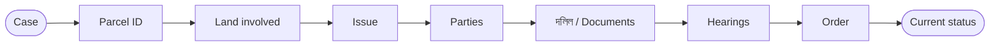

This creates a **parcel-centric legal/administrative history**.

---

## 11. Complaint & 16122 Support

### What it is
Land-service support through **16122** (ভূমি সেবা হটলাইন), including complaint and technical-support pathways.

### Where to find it
- **Call:** 16122
- **Web:** https://hotline.land.gov.bd/
- **Manual:** https://www.land.gov.bd/manual

### Problem
Support usually starts **after** something has already gone wrong, and it's hard to track.

### Improvement — a **Land Service Case Management** system so support is measurable and transparent

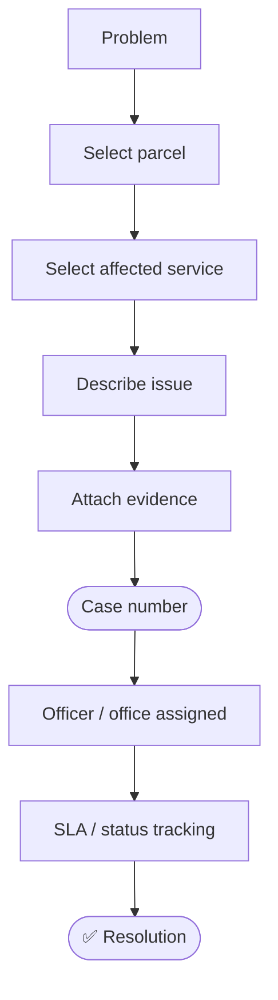

---

## 12. Main Bangladesh Gaps

| # | Gap | Fix |
|---|---|---|
| 1 | No single parcel-centric experience | BD Parcel ID + My Land dashboard |
| 2 | Fragmented identifiers | Keep existing IDs internally, expose one stable **Parcel ID** |
| 3 | Incomplete reconciliation | Continuous data-quality / reconciliation service |
| 4 | Maps aren't the universal property interface | Make the map the front door to the land record |
| 5 | Weak proactive notification model | Property Activity Alerts |
| 6 | History less intuitive than it could be | Timeline + document links + change explanation |
| 7 | Payment uncertainty | Transaction ID + reconciliation + "do not pay again" + auto receipt |
| 8 | Application-centric UX | Start from the citizen's property, not the service |
| 9 | Limited interoperability | Common APIs around Parcel ID + authorization |
| 10 | Limited property-intelligence view | One Property Profile: Map, Ownership, Tax, নামজারি, History, দলিল, Restrictions, Alerts |

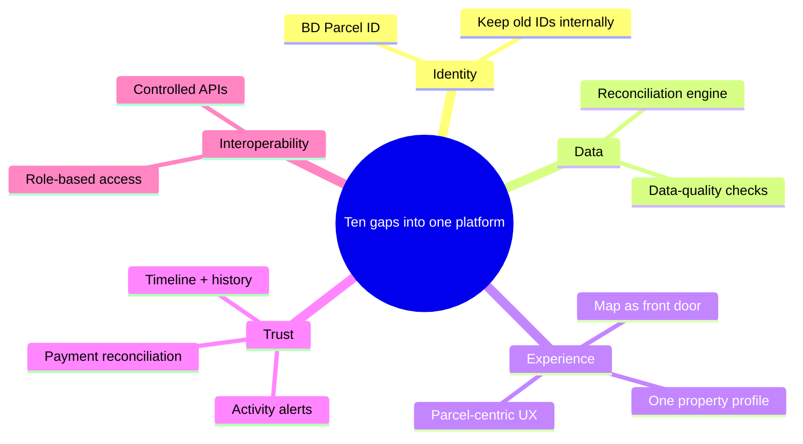

---

## 13. Proposed "My Land Bangladesh" Product

### Home

| MY LAND | |
|---|---|
| 3 | Properties |
| 1 | Tax due |
| 1 | Application in progress |
| 2 | Recent alerts |

### Property card

| Savar Property — 5.00 decimal | |
|---|---|
| Ownership | ✅ |
| নামজারি | ✅ |
| ভূমি কর | ✅ |
| Map | ✅ |
| দলিল / Documents | 8 |
| History | 12 events |

### Property Profile

| PARCEL `BD-DHK-SAV-000001` | Value |
|---|---|
| Location | Savar, Dhaka |
| Recorded area | 5.00 decimal |
| Mapped area | 5.02 decimal |
| Ownership | Verified 🟢 |
| নামজারি / Mutation | Completed 🟢 |
| ভূমি কর / Land tax | Paid 🟢 |
| Restrictions | No active record-based alert 🟢 |
| দলিল / Documents | 8 |
| History | 12 events |
| Recent activity | None |

> A mapped-area comparison is a **verification flag**, not proof of a legal boundary discrepancy.

### Land Verification / Risk Report

| Check | Status |
|---|---|
| Ownership | 🟢 |
| Parcel geometry | 🟢 |
| Tax status | 🟢 |
| নামজারি | 🟢 |
| Historical records | 🟢 |
| Pending activity | 🟡 |
| Restrictions | 🟡 |
| Document consistency | 🟢 |
| **Record-based status** | **REVIEW RECOMMENDED** |

> Never market this as a legal guarantee. Suggested disclaimer: *"This report summarizes available government-record signals and does not replace legal due diligence, survey verification or professional advice."*

### Improved Payment Experience

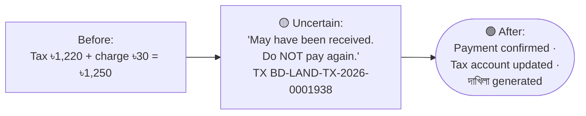

### Property Activity Alerts

| PROPERTY ALERT — new official activity detected | |
|---|---|
| Parcel | `BD-DHK-SAV-000001` |
| Activity | নামজারি application |
| Time | 17 Aug 2026 |

Alerts could cover নামজারি applications, ownership changes, record corrections, mortgage/charge events, and other defined official activity. The alert should say **"activity detected,"** not automatically label it fraud.

### Land Transaction Workspace

A collaborative space to run a full sale/transfer in one place:

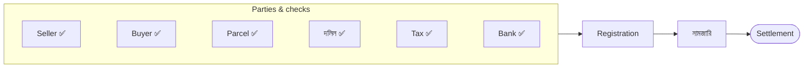

### Satellite & GIS Intelligence *(monitoring layer, not an ownership source)*

Land-use change, water-body change, urban expansion, erosion/accretion, infrastructure change, government-land monitoring. Possible stack: PostGIS, GeoJSON/vector tiles, Sentinel/Landsat (or other authorized imagery), Google Earth Engine (within licensing), MapLibre/Mapbox.

> Satellite imagery is evidence for monitoring, **not** proof of legal ownership or cadastral boundary.

---

## 14. Technical Architecture, Database, PostGIS, Mapping, APIs

### Recommended architecture

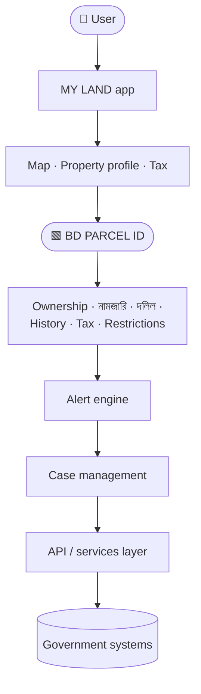

### Suggested database model

Core table **`land_parcel`** links everything through **`parcel_id`**.

```mermaid
erDiagram
    land_parcel ||--o{ parcel_owners : has
    land_parcel ||--o{ ownership_history : records
    land_parcel ||--o{ khatian_records : "খতিয়ান"
    land_parcel ||--o{ mutation_records : "নামজারি"
    land_parcel ||--o{ land_tax_records : "ভূমি কর"
    land_parcel ||--o{ deeds : "দলিল"
    land_parcel ||--o{ survey_records : surveyed_by
    land_parcel ||--o{ restrictions : flagged_by
    land_parcel ||--o{ court_cases : subject_of
    land_parcel ||--o{ acquisition_cases : subject_of
    land_parcel ||--o{ lease_records : leased_as
    land_parcel ||--o{ payments : billed
    land_parcel ||--o{ documents : stores
    land_parcel ||--o{ notifications : triggers
    land_parcel ||--o{ audit_logs : audited_by
    land_parcel {
        string parcel_id PK
        string district
        string upazila
        string mouza
        string jl_number
        string dag_number
        float  area_recorded
        geometry geometry
        string status
        datetime created_at
        datetime updated_at
    }
```

### PostGIS
A strong fit — it extends PostgreSQL with geographic types, spatial operations and indexing (parcel polygons, point-in-polygon, area calculation, geometry comparison, proximity search, spatial filtering/indexes). Source: https://postgis.net/

### Mapping
Use authoritative Bangladesh GIS → PostGIS → vector tiles → MapLibre / Mapbox / Google Maps for display only. Google Maps/OSM are context layers, **not** the authoritative land registry; don't derive a cadastral dataset by tracing commercial imagery.

### API architecture
Controlled, role-based, privacy-aware APIs around Parcel ID:

```http
GET /parcels/{parcelId}
GET /parcels/{parcelId}/ownership
GET /parcels/{parcelId}/map
GET /parcels/{parcelId}/tax
GET /parcels/{parcelId}/mutation
GET /parcels/{parcelId}/history
GET /parcels/{parcelId}/documents
GET /parcels/{parcelId}/restrictions
GET /parcels/{parcelId}/alerts
```

Not all ownership/personal information should be public.

---

## 15. Security & Trust

| Control | What it protects |
|---|---|
| **Identity** | Strong authentication for high-risk actions |
| **MFA** | Especially ownership-changing activities |
| **Audit log** | WHO / WHAT / WHEN / WHICH PARCEL / WHICH RECORD / WHAT CHANGED |
| **Digital signatures** | Legally recognized signing infrastructure where appropriate |
| **Document verification** | QR / verification code → official validation endpoint |
| **Role-based access** | Citizen, land officer, surveyor, bank, lawyer/conveyancer, government agency |
| **Privacy** | Expose only data appropriate to the user and legal purpose |

---

## 16. Implementation Roadmap

```mermaid
gantt
    title My Land Bangladesh — phased rollout
    dateFormat YYYY-MM
    axisFormat %Y
    section Foundation
    P1 Data foundation (Parcel ID · PostGIS · reconciliation)   :p1, 2026-01, 12M
    section Platform
    P2 Citizen platform (My Land · profile · map · timeline)    :p2, after p1, 10M
    section Integration
    P3 Service integration (tax · নামজারি · payment · complaints):p3, after p2, 10M
    section Trust
    P4 Trust & security (alerts · reconciliation · MFA · audit)  :p4, after p3, 8M
    section Intelligence
    P5 Intelligence (satellite · anomaly · risk screening)       :p5, after p4, 10M
    section Ecosystem
    P6 Ecosystem (controlled APIs for banks · legal · surveyors) :p6, after p5, 10M
```

| Phase | Focus | Goal |
|---|---|---|
| **1 — Data foundation** | Parcel schema, Parcel ID, PostGIS, GIS ingestion, খতিয়ান/দাগ/holding links, data-quality checks | One digital identity for land |
| **2 — Citizen platform** | My Land, property profile, interactive map, documents, timeline | Property (not service) at the centre |
| **3 — Service integration** | Tax, নামজারি, payment, document verification, complaints, case tracking | Existing services feel like one system |
| **4 — Trust & security** | Activity alerts, payment reconciliation, MFA, audit logs, digital signatures | Trustworthy digital transactions |
| **5 — Intelligence** | Satellite change detection, land-use layers, area-discrepancy & anomaly detection, risk screening | A land-intelligence system |
| **6 — Ecosystem** | Controlled APIs for banks, legal professionals, surveyors, property companies, agencies | Interoperable land data |

---

## 17. Priority Feature Matrix

```mermaid
quadrantChart
    title Value vs. difficulty — what to build first
    x-axis "Easier" --> "Harder"
    y-axis "Lower value" --> "Higher value"
    quadrant-1 "Big bets (plan)"
    quadrant-2 "Do first (P0/P1)"
    quadrant-3 "Fill-ins"
    quadrant-4 "Reconsider"
    "BD Parcel ID": [0.75, 0.97]
    "My Land dashboard": [0.5, 0.95]
    "Parcel-centric map": [0.78, 0.95]
    "Data reconciliation": [0.9, 0.96]
    "Land Timeline": [0.45, 0.85]
    "Payment reconciliation": [0.7, 0.85]
    "Property alerts": [0.6, 0.95]
    "Mutation wizard": [0.5, 0.85]
    "Document vault": [0.5, 0.75]
    "Transaction workspace": [0.92, 0.95]
    "API ecosystem": [0.72, 0.85]
    "Satellite intelligence": [0.75, 0.72]
    "3D visualization": [0.75, 0.45]
```

| Feature | Value | Difficulty | Priority |
|---|---:|---:|:--:|
| BD Parcel ID | 10/10 | High | 🔥 P0 |
| My Land dashboard | 10/10 | Medium | 🔥 P0 |
| Parcel-centric map | 10/10 | High | 🔥 P0 |
| Data reconciliation | 10/10 | Very High | 🔥 P0 |
| Land Timeline | 9/10 | Medium | P1 |
| Payment reconciliation | 9/10 | High | P1 |
| Property alerts | 10/10 | Medium/High | P1 |
| Mutation wizard | 9/10 | Medium | P1 |
| Document vault | 8/10 | Medium | P1 |
| Transaction workspace | 10/10 | Very High | P2 |
| API ecosystem | 9/10 | High | P2 |
| Satellite intelligence | 8/10 | High | P2 |
| 3D visualization | 5/10 | High | P3 |

---

## 18. What NOT to Do

> Do not create another isolated tax portal, নামজারি portal, map viewer, payment page or document repository. Bangladesh already has substantial pieces of these. **The higher-value product is the integration layer.**

---

## 19. Core Product Concept

### Bangladesh Parcel-Centric Digital Land Platform
> **One Parcel. One Identity. One History. One Trusted View.**

```mermaid
flowchart LR
    subgraph CIT["Citizen sees"]
        direction LR
        MAP["Map"] --> PAR["Parcel"] --> OWN["Owner"] --> DOC["দলিল"] --> MUT["নামজারি"] --> TAX["ভূমি কর"] --> HIS["History"] --> RES["Restrictions"] --> PAY["Payment"] --> ALT["Alerts"]
    end
    subgraph GOV["Government gets"]
        direction TB
        g1["Cleaner data"]
        g2["Better interoperability"]
        g3["Lower duplication"]
        g4["Better auditability"]
        g5["Faster services"]
        g6["Better planning"]
        g7["Fraud-detection support"]
    end
    CIT ==> GOV
```

---

## 20. Conclusion

Bangladesh already has strong building blocks: **নামজারি + ভূমি উন্নয়ন কর + digital maps + land history + digital documents + 16122 support**, plus the live BDS re-survey that will make a national Parcel ID real.

```mermaid
flowchart TD
    OLD["OLD MODEL:<br/>Service → Form → Record → Payment"] ==> TGT
    subgraph TGT["TARGET MODEL"]
        direction TB
        PID(["PARCEL ID"])
        PID --- o["Ownership"]
        PID --- m["Map"]
        PID --- t["Tax"]
        PID --- mu["Mutation"]
        PID --- h["History"]
        PID --- d["Documents"]
        o & m & t & mu & h & d --> sec["Alerts & security"]
        sec --> dt(["Digital transactions"])
    end
```

> **The goal is not another land website.** The goal is a **parcel-centric national digital land platform** that connects Bangladesh's existing land services into one understandable, auditable, trustworthy property experience.

---

## 21. Appendix — Verified Figures & Sources

### Key verified figures

| Programme | Figure | As of |
|---|---|---|
| e-Namjari (নামজারি) applications, nationally | ~22 lakh (2.2M)/yr | Ministry of Land / e-Namjari app listing |
| e-Namjari statutory processing window | 45 working days | 2025 Ministry circular |
| National Land Zoning Project coverage | 56,348 মৌজা, 4,562 ইউনিয়ন, 493 উপজেলা, 64 জেলা | Ministry of Land project document |
| National Land Zoning map sheets | 1,38,412 | Ministry of Land project document |
| BDS pilot-phase coverage | 634 মৌজা, 933 sq km | Nov 2023 |
| BDS national geo-referencing points target | 2,60,310 across 470 উপজেলা | Ministry of Land briefing |
| BDS/EDLMS reported progress | ~37% | Ministry of Land briefing (pre-2026) |
| BDS target completion | 2026 | Land Ministry direction to EDLMS project |

> Re-verify all figures at the primary source before using them for planning, funding or academic work — Bangladesh's land-digitisation programmes are updated frequently.

### Bangladesh official portals & apps
- Ministry of Land: https://www.land.gov.bd/
- Citizen services (Bangla): https://land.gov.bd/nagorik-subidha?lang=bn
- e-Mutation portal: https://mutation.land.gov.bd/ · App: "নামজারি" on Google Play
- Land Development Tax portal: https://ldtax.gov.bd/
- LDTax user manual: https://traininglims.land.gov.bd/limslrb/ldtax/citizen/user_manual
- Smart Bhumi Naksha (map): https://map.land.gov.bd/
- Smart Bhumi Naksha privacy policy: https://map.land.gov.bd/land-zoning/privacy-policy
- ভূমি সেবা হটলাইন (16122): https://hotline.land.gov.bd/
- Ministry of Land manual: https://www.land.gov.bd/manual
- bKash land-tax service: https://www.bkash.com/en/products-services/land-tax

### Bangladesh news & project reporting
- Bangladesh Post — "Journey of digital land survey officially begins in Bangladesh"
- Bangladesh Post — "Bangladesh digital survey will help reduce public sufferings: Minister"
- The Business Standard — "Land minister launches Bangladesh Digital Survey in Chattogram"
- The Business Standard — "Digital land survey to be completed soon: Minister"
- Daily Country Today — "Land Minister directs to complete BDS operations under EDLMS project by 2026"
- The Financial Express — "Digital push aims to revolutionise land management"
- United News of Bangladesh (UNB) — "Bangladesh to automate land management and services"
- Dhaka Tribune (archive) — "Bangladesh to automate land management and services"

### Technology reference
- PostGIS: https://postgis.net/

---

*Compiled from publicly available Bangladesh government sources and news reporting current as of 17 August 2026, alongside original product-design recommendations. All international/foreign benchmarking has been removed at the reader's request. Government statistics change frequently — always confirm at the primary source before using them in a decision-making, funding or academic context.*
