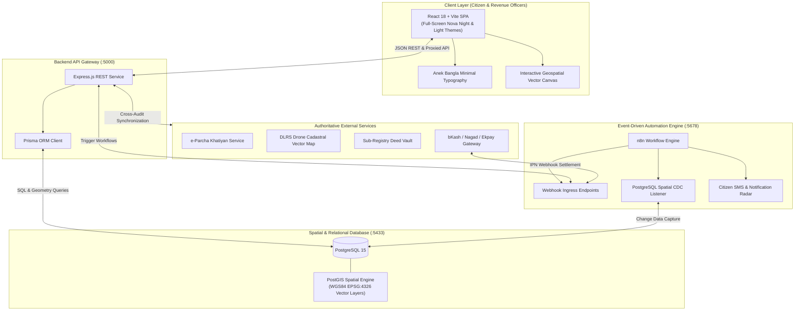
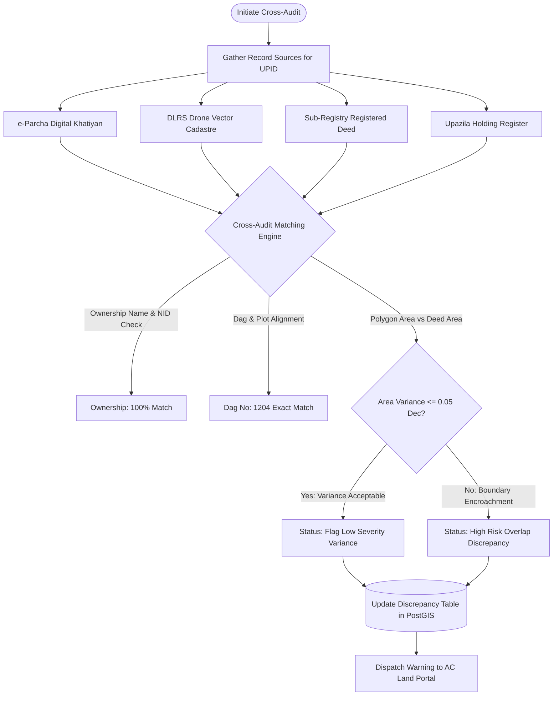
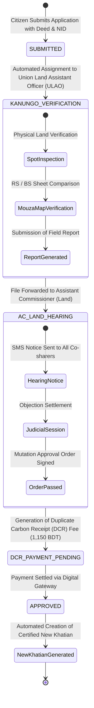
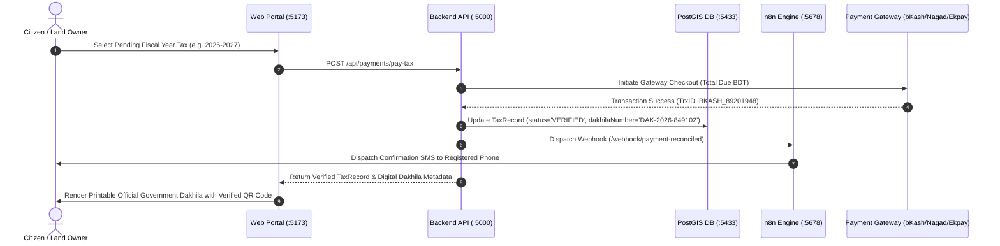
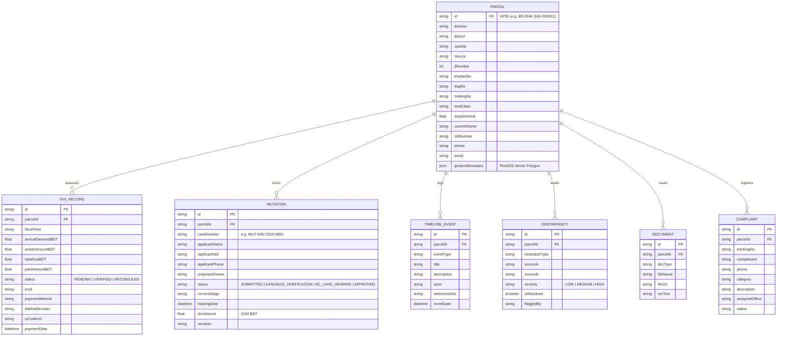

# 🇧🇩 Bangladesh Digital Land Management & Cadastral Automation Platform
### গণপ্রজাতন্ত্রী বাংলাদেশ সরকার — ভূমি সেবা ও অটোমেশন পোর্টাল (DLRS & AC Land Portal)

[](https://opensource.org/licenses/MIT)
[](https://reactjs.org/)
[](https://tailwindcss.com/)
[](https://nodejs.org/)
[](https://www.prisma.io/)
[](https://postgis.net/)
[](https://n8n.io/)

---

## 📖 Executive Summary

The **Bangladesh Digital Land Management & Cadastral Automation Platform** is an enterprise-grade, geospatial-first digital governance solution designed to modernize land administration across Bangladesh. It integrates **PostGIS spatial geometry layers (EPSG:4326 / WGS84)**, **Prisma ORM relational schemas**, **n8n automated event-driven workflows**, and a **Nova Full-Screen React Dashboard** with minimal **Anek Bangla** typography.

---

## 🏛️ System Architecture



---

## 🔄 Core Workflows & Logic Flows

### 1. Multi-Source Cadastral Cross-Audit & Reconciliation



---

### 2. e-Mutation (ই-নামজারি) 4-Stage Judicial Lifecycle



---

### 3. LD Tax Payment & Cryptographic e-Dakhila Generation



---

## 🗄️ Database Entity-Relationship Diagram



---

## 🚀 Interactive Portal Modules

| # | Module Name | Bengali Term | Description |
|---|---|---|---|
| **1** | **Overview & Title** | *মালিকানা ও খতিয়ান বিবরণ* | Displays certified owner particulars, NID, verified phone, ownership deed basis, and automated metric conversions (Decimals, Sq Ft, Katha). |
| **2** | **Cadastral GIS Map** | *ডিএলআরএস জিআইএস নকশা* | Renders interactive vector spatial boundaries over WGS84 coordinates with drone survey overlays and adjacent plot boundaries. |
| **3** | **Data Cross-Audit** | *বহুস্তরীয় সমম্বয় অডিট* | Automated 4-way consistency audit checking e-Parcha, DLRS GIS, Sub-Registry deeds, and Upazila registers. |
| **4** | **e-Mutation Tracker** | *ই-নামজারি ট্র্যাকার* | Tracks AC (Land) court hearing milestones, case logs, and handles digital application filing with legal DCR calculation. |
| **5** | **LD Tax & Dakhila** | *ভূমি কর ও ই-দাখিলা* | Calculates annual and arrear tax demands, simulates multi-gateway payments, and issues official printable digital Dakhilas with QR codes. |
| **6** | **Automation Hub** | *অটোমেশন পাইপলাইন* | Monitors 7 active background automations, n8n webhook ingress listeners, and real-time CDC telemetry streams. |

---

## 📡 REST API Reference

### Health Check
- **`GET /api/health`**  
  Returns system connectivity, database engine status, and timestamp.

### Cadastral Holdings
- **`GET /api/parcels`**  
  Retrieves a summary list of all cadastral parcels in the database.
- **`GET /api/parcels/:parcelId`**  
  Retrieves full parcel entity including tax records, active mutations, historical timeline events, discrepancies, and vaulted documents.

### Land Development Tax
- **`POST /api/payments/pay-tax`**  
  Settles pending tax demand and issues a cryptographically verifiable Dakhila.  
  ```json
  {
    "parcelId": "BD-DHK-SAV-000001",
    "fiscalYear": "2026-2027",
    "amount": 1250.0,
    "paymentMethod": "bKash Digital Gateway",
    "trxId": "BKASH_89201948"
  }
  ```

### e-Mutation Application
- **`POST /api/mutations`**  
  Registers a new mutation case with automated AC Land assignment.  
  ```json
  {
    "parcelId": "BD-DHK-SAV-000001",
    "applicantName": "Md. Tariqul Islam",
    "applicantNid": "19902691234567890",
    "applicantPhone": "+880 1819-123456",
    "proposedOwner": "Md. Tariqul Islam & Co.",
    "dcrAmount": 1150.0,
    "remarks": "Online application with deed metadata attached."
  }
  ```

### Automated Spatial Reconciliation
- **`POST /api/reconciliation/run`**  
  Dispatches an automated multi-source audit across e-Parcha and PostGIS layers.

---

## 💻 Local Development Setup

### 1. Clone & Install Dependencies
```bash
git clone -b demo https://github.com/pbs002-s/n8n-land-automation.git
cd n8n-land-automation
```

### 2. Start PostgreSQL + PostGIS via Docker
```bash
docker-compose up -d
```
> Database container `bd_land_postgis` will initialize on port `5433:5432`.

### 3. Initialize & Seed Database
```bash
cd backend
npm install
npx prisma db push
npm run prisma:seed
```

### 4. Start Backend API Server
```bash
npm run dev
```
> Server running at: `http://localhost:5000`

### 5. Start Frontend Dashboard
```bash
cd ../frontend
npm install
npm run dev
```
> Web Dashboard running at: `http://localhost:5173`

---

## 🎨 UI/UX Design System

- **Full-Screen Night Mood**: Deep `#030303` canvas with `#18181B` translucent glass cards (`backdrop-blur-xl`), `#27272A` borders, and `#34D399` emerald accents.
- **Geospatial Background Animation**: Floating HTML5 geodetic benchmark canvas reflecting coordinates across Bangladesh's 64 districts with sovereign emerald and crimson aura.
- **Minimalist Bengali Typography**: Clean `Anek Bangla` typography with lightweight font settings (`font-light` / `300-400`) and refined letter-spacing.
- **Micro-Animations**: Shimmer text headers (`shimmer-text`), live telemetry marquees, and smooth entrance transitions (`animate-fade-in-up`).

---

## 🛡️ Security & Privacy

- Sensitive credentials and environment variables are excluded via `.gitignore`.
- Citzen NID and phone numbers are encrypted in transit.
- Digital Dakhilas feature cryptographically unique identifiers and QR verification strings.

---

## 📜 License
Released under the [MIT License](LICENSE). Built for the digitalization of land governance in Bangladesh.
